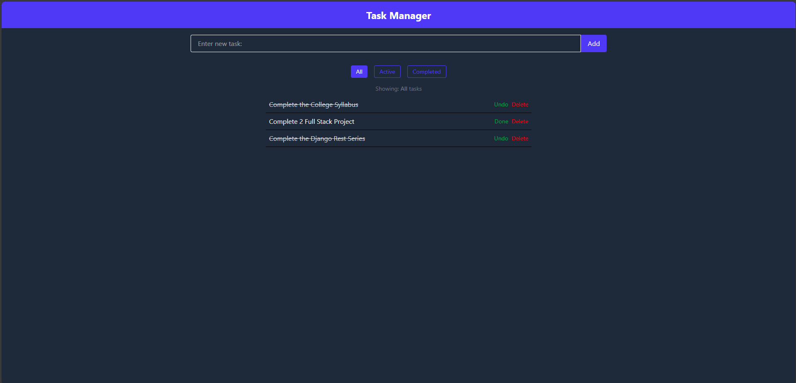

# 📝 Task Manager Webpage

A simple yet functional **Task Manager** web application built using **React**, **Context API** for global state management, and **TailwindCSS** for styling.

## 🚀 Features

- ✅ Add and delete tasks
- 📌 Mark tasks as completed or pending
- 🧠 Global state management using React Context API
- 💡 Clean and responsive UI with TailwindCSS
- 🌙 Dark mode support (optional)

## 📸 Demo



> *(Add your own screenshot or a live link if deployed)*

---

## 🛠️ Tech Stack

- ⚛️ [React](https://reactjs.org/)
- 📦 [Context API](https://reactjs.org/docs/context.html)
- 🎨 [TailwindCSS](https://tailwindcss.com/)

---


## 🔗 Clone This Project

You can clone this project using Git:

```bash
# Step 1: Clone the repository
git clone https://github.com/your-username/task-manager.git

# Step 2: Navigate to the project folder
cd task-manager

# Step 3: Install dependencies
npm install

# Step 4: Start the development server
npm start