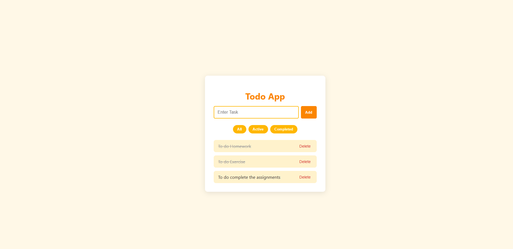

# 📝 Todo App

A beautiful and responsive **Todo List Application** built with React and styled in a warm **yellow-orange theme**. Easily add, complete, delete, and filter your tasks.

---


## 📸 Screenshots

<!-- Replace the links below with your actual image URLs -->
| Home |
|------|
|  |


---

## 🔧 Features

- ✅ Add new todos
- ✏️ Mark tasks as complete/incomplete
- ❌ Delete tasks
- 🔍 Filter by All / Active / Completed
- 🎨 Beautiful yellow-orange theme
- 📱 Fully responsive design

---

## 🛠️ Tech Stack

- **React**
- **Redux / useReducer** (optional depending on your state management)
- **CSS (custom styles)**

---

## 📦 Installation

To run this project locally:

```bash
# Clone the repository
git clone https://github.com/your-username/todo-app.git

# Navigate into the folder
cd todo-app

# Install dependencies
npm install

# Start the development server
npm start
