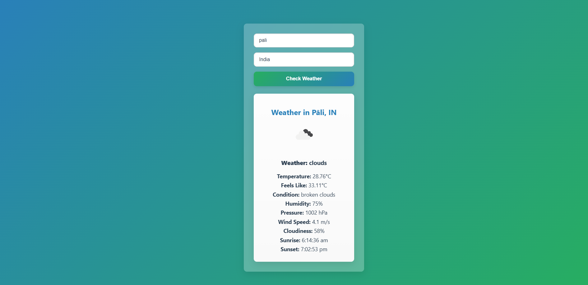

# 🌦️ Weather Application

A clean, responsive weather application built using **React** and the **OpenWeatherMap API**. Users can search for current weather details by city and country, view weather icons, temperatures, wind, humidity, and more — all styled with a beautiful blue-green UI theme.

---

## 📸 Screenshots

> Add screenshots of your app here (drag and drop images into GitHub after creating the README)

| Home Page               | Weather Result            |
|-------------------------|---------------------------|
|  |  |

---


## 🧰 Features

- 🌍 Search weather by city and country
- 🌡️ Current temperature, feels-like, pressure, humidity, wind speed
- 🧠 Dynamic weather icons and conditions
- 🎨 Adaptive backgrounds based on weather (rain, clear, etc.)
- 🖼️ App logo shown behind results
- ⚡ Fast, mobile-friendly design with responsive layout

---

## 🛠️ Tech Stack

- **React**
- **CSS3**
- **OpenWeatherMap API**
- **HTML5**

---

## 📦 Installation & Setup

```bash
# 1. Clone the repo
git clone https://github.com/your-username/weather-app.git

# 2. Navigate into the project
cd weather-app

# 3. Install dependencies
npm install

# 4. Start the development server
npm start
